# Pulling Encrypted Container Images in Confidential VMs Without Kata Runtime

This document explains the architecture and mechanisms for pulling encrypted container images in Confidential VMs (CVMs) without the Kata runtime. It covers the standard Kubernetes image pull process, how Confidential Containers (CoCo) handles encrypted images, and how to achieve attestation-gated decryption in a CVM using only the Attestation Agent.

> **Practical Implementation**: For step-by-step instructions on deploying this architecture on Azure TDX CVMs, see the companion [DEMO.md](./DEMO.md).

## Table of Contents

1. [Standard Kubernetes Image Pull Process](#1-standard-kubernetes-image-pull-process)
2. [CoCo Encrypted Image Pull Flow](#2-coco-encrypted-image-pull-flow)
3. [Pulling Encrypted Images Without Kata Runtime](#3-pulling-encrypted-images-without-kata-runtime)

---

## 1. Standard Kubernetes Image Pull Process

### 1.1 Overview

When a Pod is scheduled to a node, Kubernetes must ensure the container images are available locally before containers can start. This process involves multiple components working together through well-defined interfaces.

### 1.2 Components Involved

| Component                             | Role                                                        |
|---------------------------------------|-------------------------------------------------------------|
| **kubelet**                           | Node agent that manages Pod lifecycle                       |
| **CRI (Container Runtime Interface)** | gRPC API between kubelet and container runtime              |
| **containerd**                        | Industry-standard container runtime                         |
| **Snapshotter**                       | Manages filesystem snapshots for container layers           |
| **Content Store**                     | Content-addressable storage for image blobs                 |
| **Registry**                          | Remote storage for container images (e.g., Docker Hub, GCR) |

### 1.3 Pull Sequence

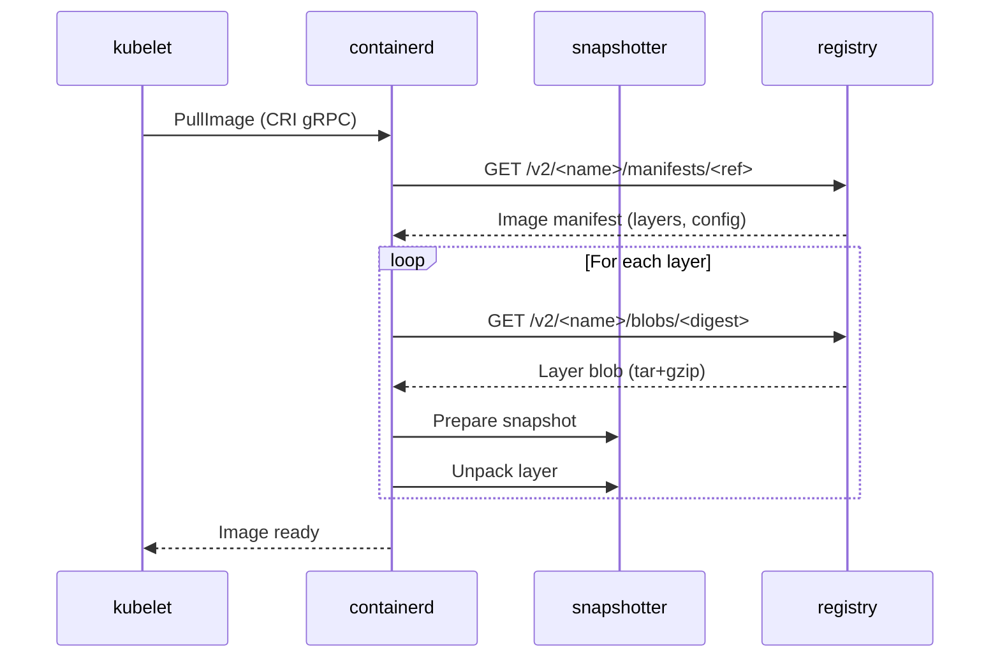

### 1.4 Step-by-Step Process

#### Step 1: Pod Scheduling and Image Check

When the kubelet receives a Pod spec, it first checks if the required images are already present locally. If not, it initiates a pull.

#### Step 2: CRI PullImage Request

The kubelet calls the CRI `PullImage` RPC on containerd, providing the image reference and any registry credentials from `imagePullSecrets`.

#### Step 3: Manifest Resolution

containerd resolves the image reference to a specific manifest:

1. **Tag resolution**: If using a tag (e.g., `nginx:latest`), query the registry for the manifest digest
2. **Manifest fetch**: Download the image manifest containing configuration and layer digests

Example OCI Image Manifest:
```json
{
  "schemaVersion": 2,
  "mediaType": "application/vnd.oci.image.manifest.v1+json",
  "config": {
    "mediaType": "application/vnd.oci.image.config.v1+json",
    "digest": "sha256:abc123...",
    "size": 1234
  },
  "layers": [
    {
      "mediaType": "application/vnd.oci.image.layer.v1.tar+gzip",
      "digest": "sha256:def456...",
      "size": 52428800
    }
  ]
}
```

#### Step 4: Layer Download and Unpacking

For each layer, containerd downloads the blob, verifies its digest, stores it in the content-addressable store, and unpacks it via the snapshotter.

### 1.5 Container Filesystem Structure

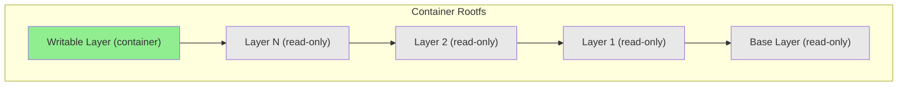

The snapshotter creates a chain of read-only snapshots for each layer, with a writable layer on top for container modifications.

### 1.6 Content-Addressable Storage

containerd uses content-addressable storage where blobs are identified by their cryptographic digest:

```
/var/lib/containerd/
├── io.containerd.content.v1.content/
│   └── blobs/sha256/
│       ├── abc123...  (config blob)
│       └── def456...  (layer blob)
└── io.containerd.snapshotter.v1.overlayfs/
    └── snapshots/
        ├── 1/  (base layer)
        └── 2/  (layer + writable)
```

### 1.7 Key Characteristics of Standard Pull

| Aspect            | Standard Behavior                        |
|-------------------|------------------------------------------|
| **Pull location** | Host (worker node)                       |
| **Layer storage** | Host filesystem                          |
| **Decryption**    | Not applicable (plaintext images)        |
| **Trust model**   | Trust the host, cluster admins, registry |
| **Verification**  | Digest verification only                 |

---

## 2. CoCo Encrypted Image Pull Flow

### 2.1 Why Encrypted Images?

In standard Kubernetes, container images are pulled on the untrusted host and stored in plaintext on the host filesystem, accessible to anyone with host access. For confidential computing workloads, this is unacceptable since images may contain proprietary code, embedded secrets, or sensitive ML models.

Confidential Containers (CoCo) addresses this by:
1. **Encrypting** container image layers
2. Pulling and decrypting images **inside the TEE**
3. Releasing decryption keys only after **remote attestation**

### 2.2 OCI Image Encryption

CoCo uses the OCI image encryption specification implemented by `ocicrypt`. Each layer is encrypted independently using a symmetric key (Layer Encryption Key), which is then wrapped by a Key Encryption Key (KEK).

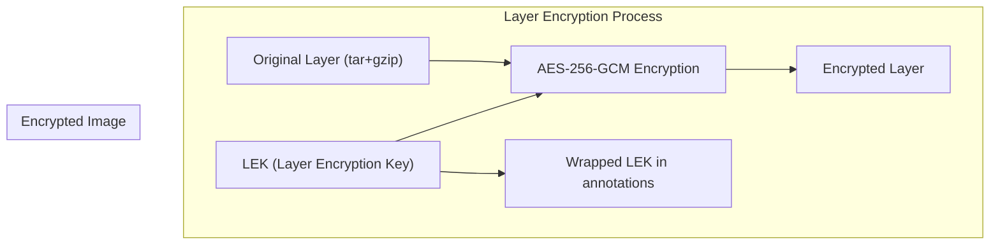

The encrypted image manifest indicates encryption via media type:

```json
{
  "layers": [
    {
      "mediaType": "application/vnd.oci.image.layer.v1.tar+gzip+encrypted",
      "digest": "sha256:encrypted-digest...",
      "annotations": {
        "org.opencontainers.image.enc.keys.provider.attestation-agent": "<wrapped-LEK>",
        "org.opencontainers.image.enc.pubopts": "<encryption-params>"
      }
    }
  ]
}
```

### 2.3 Key Hierarchy

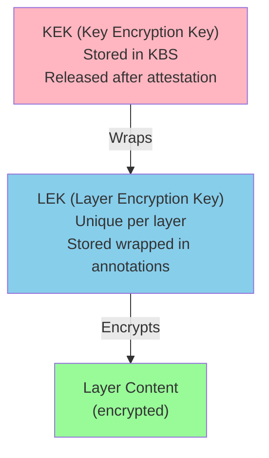

- **KEK (Key Encryption Key)**: Master key stored in the Key Broker Service (KBS), released only after successful TEE attestation
- **LEK (Layer Encryption Key)**: Symmetric key unique to each layer, wrapped by the KEK and stored in image annotations

### 2.4 CoCo Architecture

CoCo uses Kata Containers to run pods inside lightweight VMs (micro-VMs) backed by hardware TEEs:

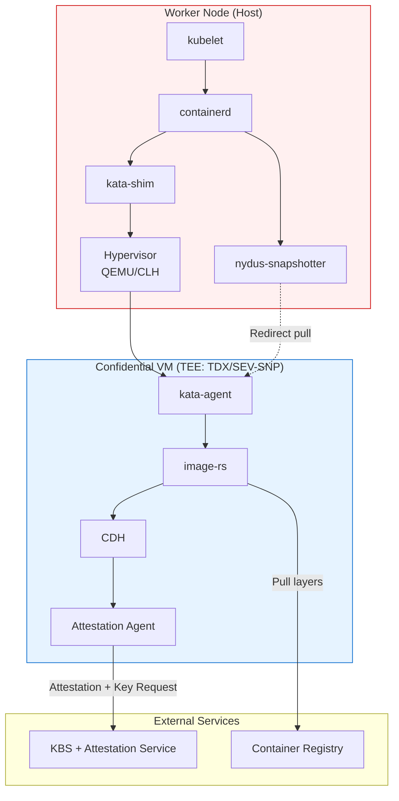

### 2.5 Guest Components

CoCo introduces several components that run **inside the TEE**:

| Component                       | Role                                                       |
|---------------------------------|------------------------------------------------------------|
| **kata-agent**                  | Manages container lifecycle inside the VM                  |
| **image-rs**                    | Rust library for pulling, decrypting, and unpacking images |
| **CDH (Confidential Data Hub)** | Coordinates secret retrieval and key management            |
| **AA (Attestation Agent)**      | Handles TEE attestation and KBS communication              |
| **ocicrypt-rs**                 | Rust implementation of OCI encryption/decryption           |

**Important**: `image-rs` is a **Rust crate (library)**, not a standalone binary. It is imported and used by `kata-agent` to perform image operations.

### 2.6 CoCo Image Pull Sequence

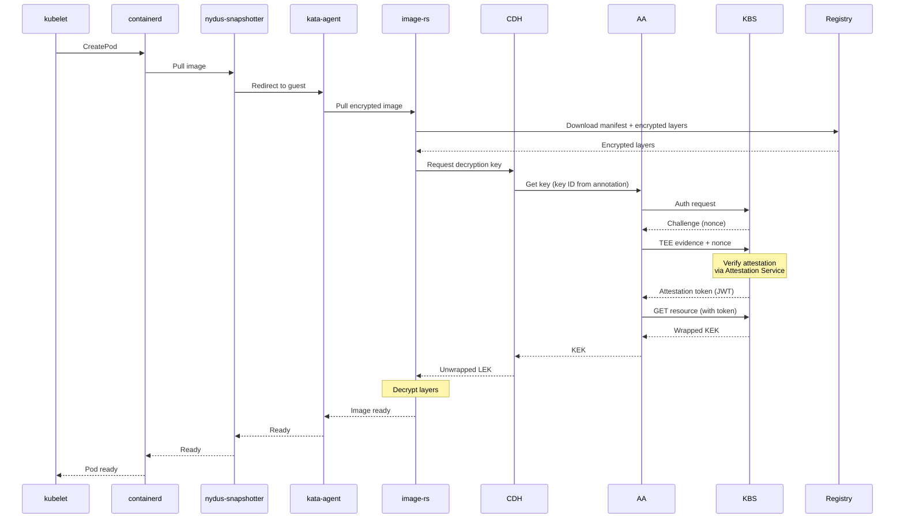

### 2.7 Attestation Protocol (RCAR)

The Attestation Agent uses the **RCAR (Request-Challenge-Attestation-Response)** protocol to establish trust with the KBS:

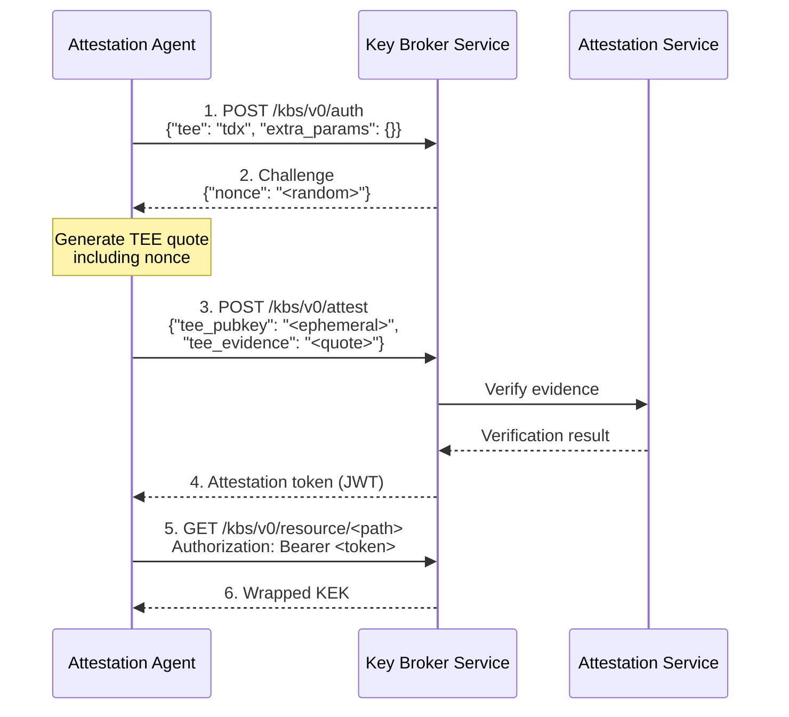

The protocol ensures:
- **Freshness**: Nonce prevents replay attacks
- **Binding**: TEE quote includes the ephemeral public key
- **Verification**: KBS validates evidence via Attestation Service before releasing keys

### 2.8 Key Differences: Standard vs CoCo

| Aspect | Standard Kubernetes | Confidential Containers |
|--------|---------------------|-------------------------|
| **Pull location** | Host | Inside TEE (guest) |
| **Image storage** | Host filesystem | Guest memory/filesystem |
| **Layer format** | Plaintext | Encrypted |
| **Key retrieval** | N/A | Attestation-gated |
| **Trust boundary** | Host, cluster admins | Hardware TEE only |
| **Runtime** | runc/crun | kata-runtime (micro-VM) |
| **Image visibility** | Visible to host | Opaque to host |

---

## 3. Pulling Encrypted Images Without Kata Runtime

### 3.1 Motivation

While CoCo provides a complete solution for confidential containers, it requires Kata Containers runtime, a hypervisor, and complex deployment. In some scenarios, you may want to:

- Run Kubernetes **directly inside a CVM** (TDX VM or SEV-SNP VM)
- Use the **standard containerd runtime** (no nested virtualization)
- Still benefit from **attestation-gated encrypted image decryption**

This architecture is simpler but trades per-pod TEE isolation for operational simplicity.

### 3.2 Solution Architecture

The key insight is that the **Attestation Agent (AA)** already implements the **ocicrypt keyprovider protocol** as a gRPC service. containerd's decryption mechanism can call AA directly.

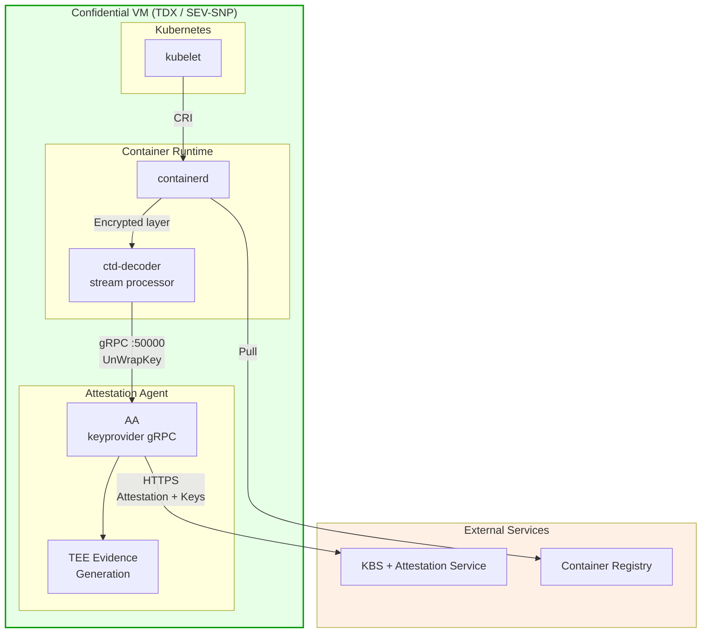

### 3.3 How It Works

#### ocicrypt Keyprovider Protocol

The `ocicrypt` library supports a **keyprovider protocol** that allows external services to handle key operations. When containerd encounters an encrypted layer:

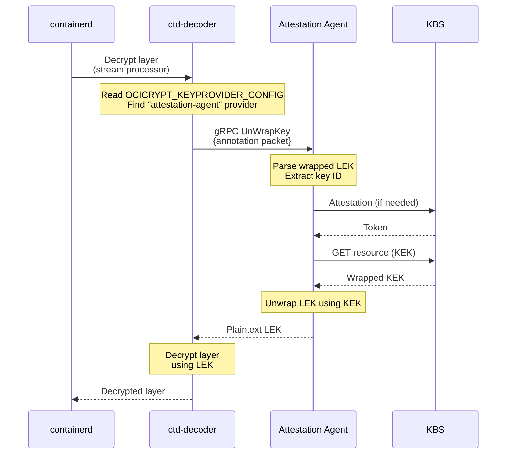

#### Attestation Agent as Keyprovider

The Attestation Agent exposes a gRPC service implementing the keyprovider protocol:

```protobuf
service KeyProviderService {
    rpc UnWrapKey(keyProviderKeyWrapProtocolInput) 
        returns (keyProviderKeyWrapProtocolOutput);
}
```

When AA receives an `UnWrapKey` request, it:
1. Parses the annotation packet containing the wrapped LEK
2. Initiates attestation with KBS if not already attested
3. Requests the KEK from KBS using the key ID in the annotation
4. Unwraps the LEK using the KEK
5. Returns the plaintext LEK to the caller

### 3.4 Components Required

| Component | Source | Role |
|-----------|--------|------|
| **containerd** | Standard distribution | Container runtime with CRI support |
| **ctd-decoder** | `containerd/imgcrypt` | Stream processor for encrypted layers |
| **Attestation Agent** | `confidential-containers/guest-components` | Keyprovider + attestation |
| **KBS + Attestation Service** | `confidential-containers/trustee` | External key broker and verifier |

### 3.5 Image Pull Flow

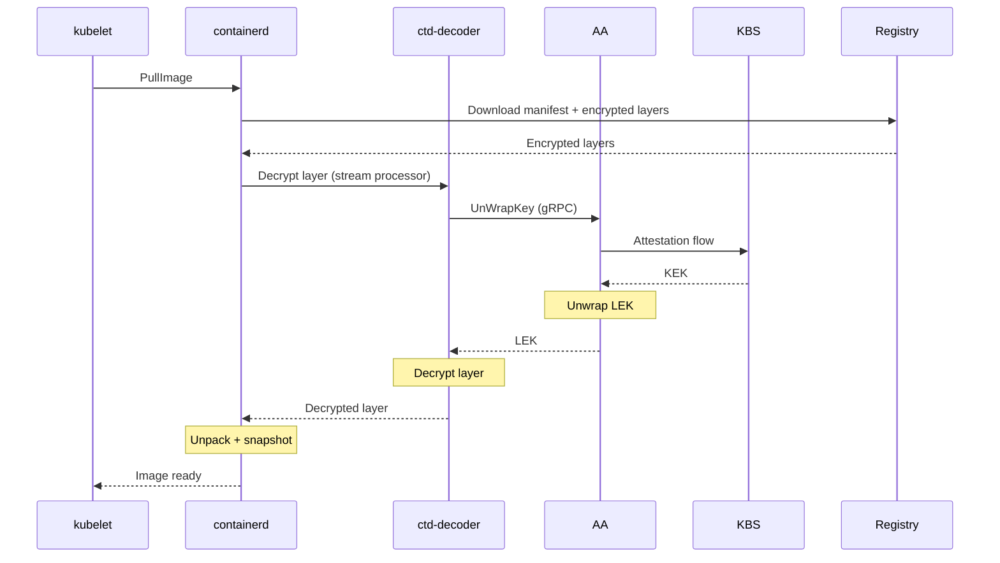

### 3.6 Comparison: CoCo vs This Approach

| Aspect             | Full CoCo (with Kata)         | Without Kata                  |
|--------------------|-------------------------------|-------------------------------|
| **TEE boundary**   | Micro-VM per pod              | Entire CVM                    |
| **Isolation**      | Pod-level hardware isolation  | Node-level hardware isolation |
| **Runtime**        | kata-runtime                  | runc/crun                     |
| **Virtualization** | Required (QEMU/CLH)           | Not required                  |
| **Components**     | kata-agent, image-rs, CDH, AA | AA only                       |
| **Complexity**     | Higher                        | Lower                         |
| **Image pull**     | Inside micro-VM               | On CVM (still in TEE)         |
| **Multi-tenancy**  | Strong (per-pod TEE)          | Weaker (shared CVM)           |

### 3.7 What We Lose Without Kata Runtime

Choosing the no-Kata approach involves significant trade-offs in security properties.

#### 3.7.1 Pod-Level TEE Isolation

**With Kata (CoCo):**

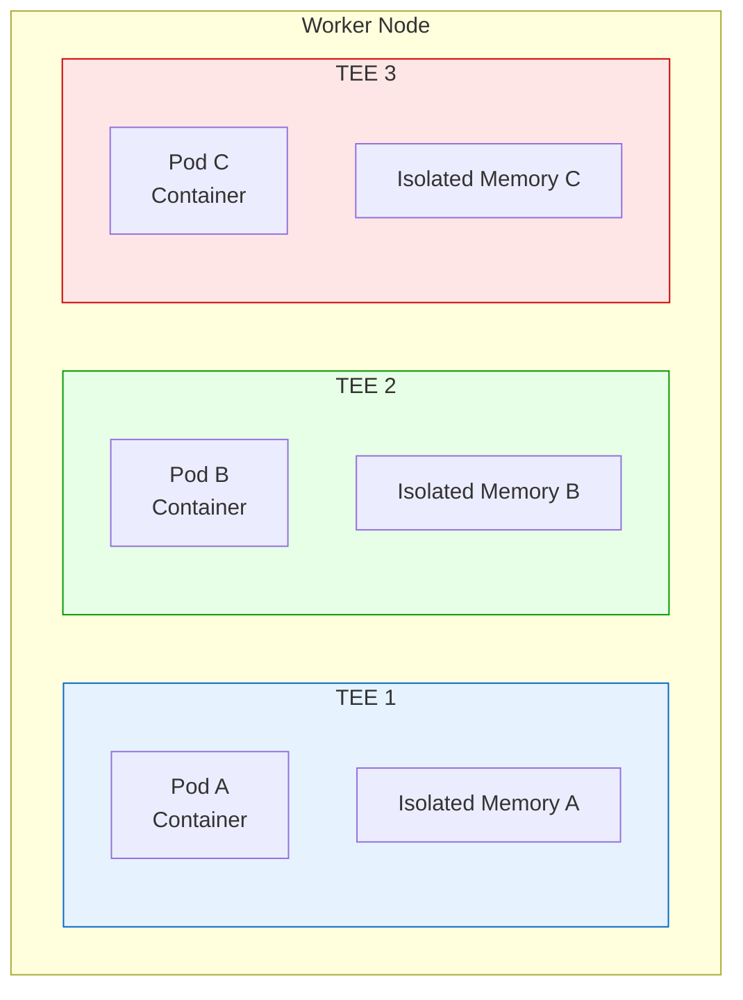

Each pod runs in its own micro-VM backed by a dedicated TEE. A compromised container cannot access another pod's memory or decrypted data.

**Without Kata:**

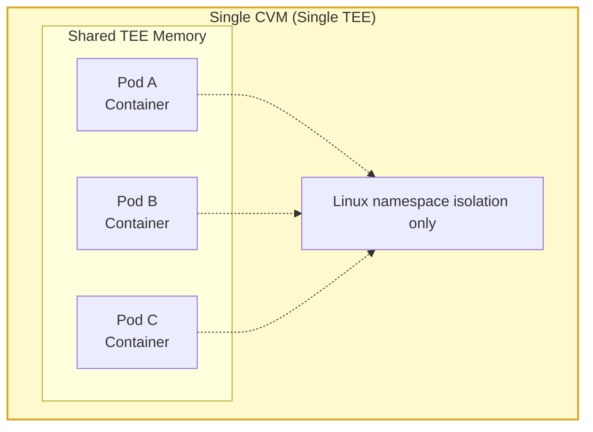

All pods share the same CVM. Container isolation relies on Linux namespaces/cgroups, not hardware TEE boundaries.

**Impact:** A container escape vulnerability could expose all workloads' decrypted data within the CVM.

#### 3.7.2 Per-Pod Attestation

| Capability               | With Kata        | Without Kata           |
|--------------------------|------------------|------------------------|
| Pod attestation identity | Unique per pod   | Single node identity   |
| KBS policy granularity   | Per-pod policies | Node-level only        |
| Workload verification    | Individual pod   | All pods same identity |
| Multi-tenant attestation | Supported        | Not supported          |

**Impact:** Multi-tenant scenarios where different workload owners require independent attestation are not supported.

#### 3.7.3 Per-Pod Encryption Keys

**With Kata:** Each pod's attestation can be verified independently, and KBS can release different keys based on pod-specific policies.

**Without Kata:** All image decryption uses the same node-level attestation. The KBS cannot distinguish which pod is requesting the key—it only sees the node's attestation evidence.

**Impact:** Cannot implement fine-grained key release policies based on pod identity.

#### 3.7.4 Kata Agent Policy Enforcement

**With Kata (CoCo):**
The kata-agent enforces Rego policies that restrict operations:

```rego
# Only allow specific images
CreateContainerRequest if {
    input.image in policy_data.allowed_images
}

# Block exec into containers
ExecProcessRequest := false
```

These policies are evaluated inside the TEE, protecting against malicious host requests.

**Without Kata:**
No equivalent policy enforcement layer. The host's kubelet/containerd directly manages containers.

**Impact:** Cannot enforce workload-specific security policies at the TEE boundary.

#### 3.7.5 Protection Against Malicious Orchestration

**With Kata:** The kata-agent validates all requests from the host. Even if the Kubernetes control plane is compromised, TEE-side policy prevents running unauthorized images, executing arbitrary commands, or mounting unauthorized volumes.

**Without Kata:** The kubelet and containerd run inside the CVM and are trusted, but the Kubernetes API server is typically outside. A compromised control plane could schedule malicious pods to the CVM.

**Impact:** Trust boundary extends to the Kubernetes control plane, not just the CVM.

#### 3.7.6 Summary: Trade-off Matrix

| Capability                        | With Kata             | Without Kata        | Impact      |
|-----------------------------------|-----------------------|---------------------|-------------|
| Pod-level TEE isolation           | ✅ Hardware enforced   | ❌ Namespace only    | High        |
| Per-pod attestation               | ✅ Yes                 | ❌ Node-level only   | High        |
| Per-pod key policies              | ✅ Yes                 | ❌ Shared identity   | Medium      |
| Agent policy enforcement          | ✅ Rego policies       | ❌ None              | High        |
| Malicious orchestrator protection | ✅ TEE-side validation | ⚠️ Partial          | Medium      |
| Integrated signature verification | ✅ Tight integration   | ⚠️ Separate config  | Low         |
| Mixed workload types              | ✅ Per-pod choice      | ❌ All-or-nothing    | Medium      |
| Deployment complexity             | ❌ Higher              | ✅ Lower             | Operational |
| Performance overhead              | ❌ VM per pod          | ✅ Native containers | Performance |

### 3.8 When the No-Kata Approach is Acceptable

Despite these limitations, the no-Kata approach is appropriate when:

1. **Single-tenant CVM**: Only one organization's workloads run in the CVM
2. **Trusted workloads**: All containers are from trusted sources and don't require isolation from each other
3. **Simplified operations**: Operational simplicity outweighs fine-grained isolation
4. **Development/testing**: Validating encrypted image workflows before full CoCo deployment
5. **Edge deployments**: Resource-constrained environments where per-pod VMs are impractical
6. **Lift-and-shift**: Migrating existing Kubernetes workloads to CVMs with minimal changes

### 3.9 Security Model

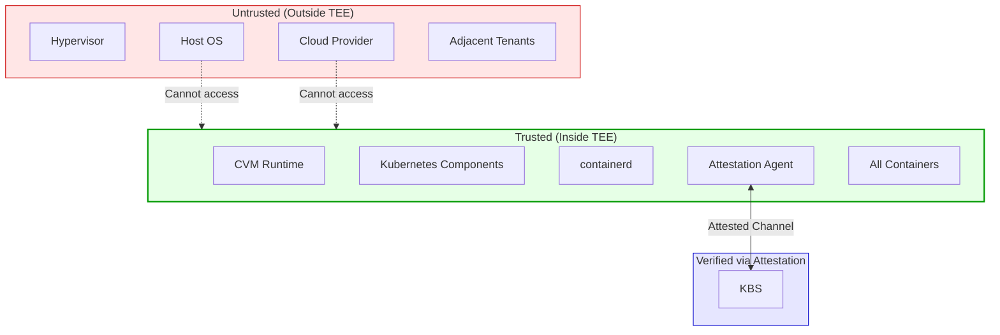

In this approach:
- The **entire CVM** is the trust boundary
- All containers share the same TEE
- Host infrastructure (hypervisor, cloud provider, adjacent tenants) remains untrusted
- Decryption keys are released only after CVM attestation
- All workloads inside the CVM must trust each other

---

## References

- [Confidential Containers Project](https://confidentialcontainers.org/)
- [CoCo Guest Components](https://github.com/confidential-containers/guest-components)
- [CoCo Trustee (KBS)](https://github.com/confidential-containers/trustee)
- [containerd imgcrypt](https://github.com/containerd/imgcrypt)
- [ocicrypt keyprovider protocol](https://github.com/containers/ocicrypt/blob/main/docs/keyprovider.md)
- [OCI Image Encryption Spec](https://github.com/opencontainers/image-spec/issues/775)
- [containerd CRI Decryption](https://github.com/containerd/containerd/blob/main/docs/cri/decryption.md)
- [Azure Confidential VMs](https://learn.microsoft.com/en-us/azure/confidential-computing/confidential-vm-overview)
- [Intel TDX Documentation](https://www.intel.com/content/www/us/en/developer/tools/trust-domain-extensions/overview.html)