# Pulling Encrypted Container Images in Confidential VMs Without Kata Runtime

This document explains the architecture and mechanisms for pulling encrypted container images in Confidential VMs (CVMs) without the Kata runtime. It covers the standard Kubernetes image pull process, how Confidential Containers (CoCo) handles encrypted images, and how to achieve attestation-gated decryption in a CVM using only the Attestation Agent.

> **Practical Implementation**: For step-by-step instructions on deploying this architecture on Azure TDX CVMs, see the companion [DEMO.md](./DEMO.md).

## Table of Contents

1. [Standard Kubernetes Image Pull Process](#1-standard-kubernetes-image-pull-process)
2. [CoCo Encrypted Image Pull Flow](#2-coco-encrypted-image-pull-flow)
3. [Pulling Encrypted Images Without Kata Runtime](#3-pulling-encrypted-images-without-kata-runtime)
4. [References](#4-references)

## 1. Standard Kubernetes Image Pull Process

### 1.1 Overview

When a Pod is scheduled to a node, Kubernetes must ensure the container images are available locally before containers can start. This process involves multiple components working together through well-defined interfaces.

### 1.2 Components Involved

| Component                             | Role                                                            |
|---------------------------------------|-----------------------------------------------------------------|
| **kubelet**                           | Node agent that manages Pod lifecycle [1]                       |
| **CRI (Container Runtime Interface)** | gRPC API between kubelet and container runtime [1]              |
| **containerd**                        | Industry-standard container runtime [2]                         |
| **Snapshotter**                       | Manages filesystem snapshots for container layers [3]           |
| **Content Store**                     | Content-addressable storage for image blobs [3]                 |
| **Registry**                          | Remote storage for container images (e.g., Docker Hub, GCR) [4] |

### 1.3 Pull Sequence

The Kubernetes Container Runtime Interface (CRI) defines the main gRPC protocol for communication between the kubelet and container runtime [1]. The `PullImage` RPC method handles image pulls through this interface [1].

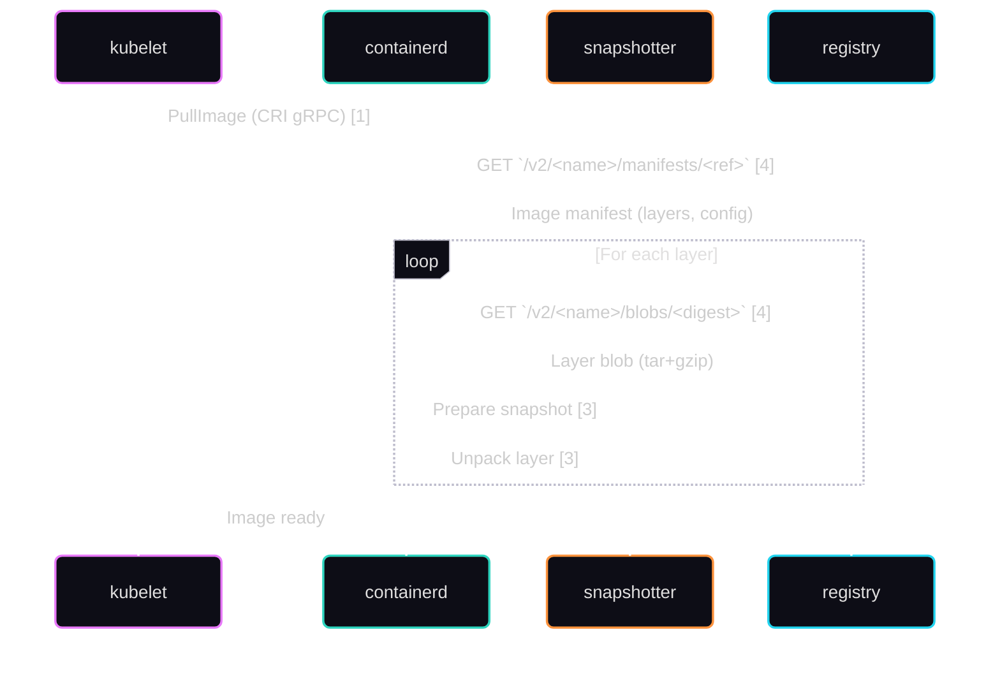

### 1.4 Step-by-Step Process

#### Step 1: Pod Scheduling and Image Check

When the kubelet receives a Pod spec, it first checks if the required images are already present locally. If not, it initiates a pull via the CRI `PullImage` RPC [1].

#### Step 2: CRI PullImage Request

The kubelet calls the CRI `PullImage` RPC on containerd, providing the image reference and any registry credentials from `imagePullSecrets` [5]. The `imagePullSecrets` field references Kubernetes Secrets of type `kubernetes.io/dockerconfigjson` containing registry credentials [5].

#### Step 3: Manifest Resolution

containerd resolves the image reference to a specific manifest using the OCI Distribution Specification [4]:

1. **Tag resolution**: If using a tag (e.g., `nginx:latest`), query the registry's manifest endpoint `GET /v2/<name>/manifests/<reference>` [4]
2. **Manifest fetch**: Download the image manifest containing configuration and layer digests [4]

Example OCI Image Manifest:
```json
{
  "schemaVersion": 2,
  "mediaType": "application/vnd.oci.image.manifest.v1+json",
  "config": {
    "mediaType": "application/vnd.oci.image.config.v1+json",
    "digest": "sha256:abc123...",
    "size": 1234
  },
  "layers": [
    {
      "mediaType": "application/vnd.oci.image.layer.v1.tar+gzip",
      "digest": "sha256:def456...",
      "size": 52428800
    }
  ]
}
```

#### Step 4: Layer Download and Unpacking

For each layer, containerd downloads the blob via `GET /v2/<name>/blobs/<digest>` [4], verifies its digest, stores it in the content-addressable store [3], and unpacks it via the snapshotter [3].

### 1.5 Container Filesystem Structure

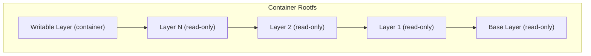

The snapshotter creates a chain of read-only snapshots for each layer, with a writable layer on top for container modifications [3]. containerd ships with several built-in snapshotters, with overlayfs as the default [3].

### 1.6 Content-Addressable Storage

containerd uses content-addressable storage where blobs are identified by their cryptographic digest [3]:

```
/var/lib/containerd/
├── io.containerd.content.v1.content/
│   └── blobs/sha256/
│       ├── abc123...  (config blob)
│       └── def456...  (layer blob)
└── io.containerd.snapshotter.v1.overlayfs/
    └── snapshots/
        ├── 1/  (base layer)
        └── 2/  (layer + writable)
```

### 1.7 Key Characteristics of Standard Pull

| Aspect | Standard Behavior |
|--------|-------------------|
| **Pull location** | Host (worker node) [1] |
| **Layer storage** | Host filesystem [3] |
| **Decryption** | Not applicable (plaintext images) |
| **Trust model** | Trust the host, cluster admins, registry |
| **Verification** | Digest verification only [3] |

## 2. CoCo Encrypted Image Pull Flow

### 2.1 Why Encrypted Images?

In standard Kubernetes, container images are pulled on the untrusted host and stored in plaintext on the host filesystem, accessible to anyone with host access. For confidential computing workloads, this is unacceptable since images may contain proprietary code, embedded secrets, or sensitive ML models.

Confidential Containers (CoCo) addresses this by [6]:
1. **Encrypting** container image layers
2. Pulling and decrypting images **inside the TEE**
3. Releasing decryption keys only after **remote attestation**

### 2.2 OCI Image Encryption

CoCo uses the OCI image encryption specification implemented by the `ocicrypt` library [7]. The ocicrypt library is the OCI image spec implementation of container image encryption [7], though the specification remains a proposed extension to OCI image-spec (PR #775) rather than a merged standard [8].

Each layer is encrypted independently using a symmetric key (Layer Encryption Key), which is then wrapped by a Key Encryption Key (KEK) [7].

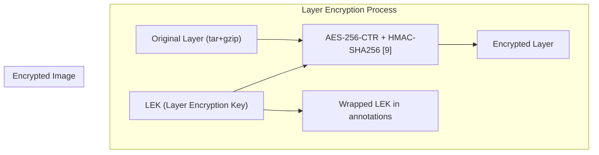

The encrypted image manifest indicates encryption via media type [10]:

```json
{
  "layers": [
    {
      "mediaType": "application/vnd.oci.image.layer.v1.tar+gzip+encrypted",
      "digest": "sha256:encrypted-digest...",
      "annotations": {
        "org.opencontainers.image.enc.keys.provider.attestation-agent": "<wrapped-LEK>",
        "org.opencontainers.image.enc.pubopts": "<encryption-params>"
      }
    }
  ]
}
```

The annotation key follows the pattern `org.opencontainers.image.enc.keys.provider.<name>` where `<name>` is the keyprovider name [11].

### 2.3 Key Hierarchy

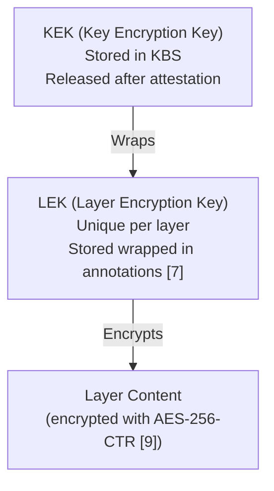

- **KEK (Key Encryption Key)**: Master key stored in the Key Broker Service (KBS), released only after successful TEE attestation [12]
- **LEK (Layer Encryption Key)**: Symmetric key unique to each layer, wrapped by the KEK and stored in image annotations [7]

### 2.4 CoCo Architecture

CoCo uses Kata Containers to run pods inside lightweight VMs (micro-VMs) backed by hardware TEEs [6]. Kata Containers is an existing open source project that encapsulates pods inside of VMs [6]. Runtime classes include `kata-qemu-snp` (AMD SEV-SNP), `kata-qemu-tdx` (Intel TDX), and `kata-qemu-sev` [13].

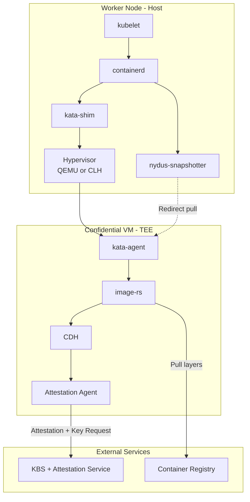

### 2.5 Guest Components

CoCo introduces several components that run **inside the TEE** [6]:

| Component                       | Role                                                          |
|---------------------------------|---------------------------------------------------------------|
| **kata-agent**                  | Manages container lifecycle inside the VM [6]                 |
| **image-rs**                    | Rust crate for pulling, decrypting, and unpacking images [14] |
| **CDH (Confidential Data Hub)** | Coordinates secret retrieval and key management [15]          |
| **AA (Attestation Agent)**      | Handles TEE attestation and KBS communication [16]            |
| **ocicrypt-rs**                 | Rust implementation of OCI encryption/decryption [7]          |

**Important**: `image-rs` is a **Rust crate (library)**, not a standalone binary. The design document states it is "a rustified and tailored version of containers/image, to provide a small, simple, secure, lightweight and high performance OCI container image management library" [14]. It is imported and used by `kata-agent` to perform image operations.

### 2.6 CoCo Image Pull Sequence

On the host, a snapshotter is used to pre-empt image pull and divert control flow to image-rs inside the guest [17].

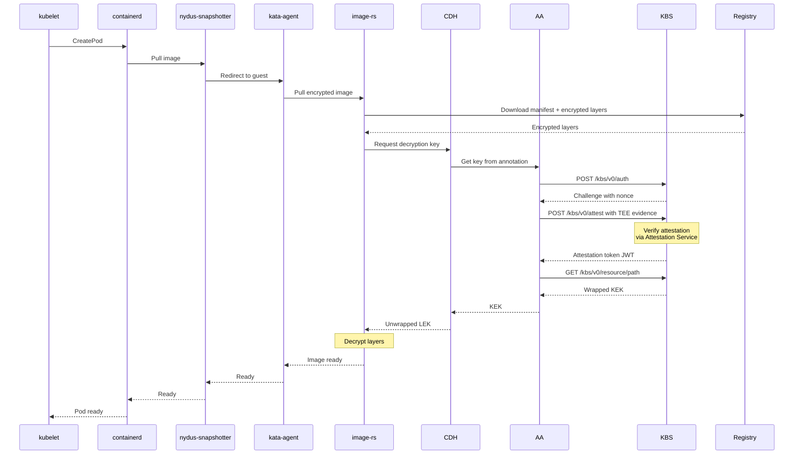

### 2.7 Attestation Protocol (RCAR)

The Attestation Agent uses the **RCAR (Request-Challenge-Attestation-Response)** protocol to establish trust with the KBS [18]. The protocol uses a "simple, universal, and extensible" method for attestation [18].

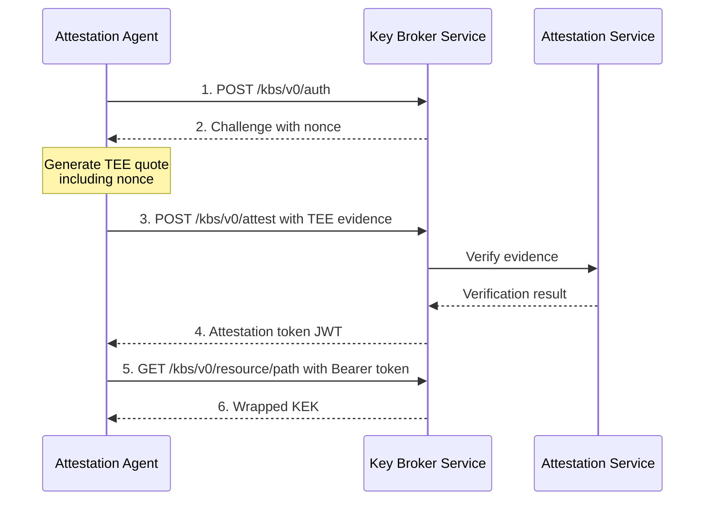

The protocol ensures:
- **Freshness**: Nonce prevents replay attacks [18]
- **Binding**: TEE quote includes the ephemeral public key [18]
- **Verification**: KBS validates evidence via Attestation Service before releasing keys [12]

### 2.8 Key Differences: Standard vs CoCo

| Aspect               | Standard Kubernetes  | Confidential Containers     |
|----------------------|----------------------|-----------------------------|
| **Pull location**    | Host [1]             | Inside TEE (guest) [6]      |
| **Image storage**    | Host filesystem [3]  | Guest memory/filesystem [6] |
| **Layer format**     | Plaintext            | Encrypted [7]               |
| **Key retrieval**    | N/A                  | Attestation-gated [18]      |
| **Trust boundary**   | Host, cluster admins | Hardware TEE only [6]       |
| **Runtime**          | runc/crun            | kata-runtime (micro-VM) [6] |
| **Image visibility** | Visible to host      | Opaque to host [6]          |

---

## 3. Pulling Encrypted Images Without Kata Runtime

> **Demo Note**: The companion [DEMO.md](./DEMO.md) implements this architecture using `offline_fs_kbc` mode, which stores decryption keys locally and **bypasses remote attestation**. This simplifies deployment but provides **no security guarantees**. 

### 3.1 Motivation

While CoCo provides a complete solution for confidential containers, it requires Kata Containers runtime, a hypervisor, and complex deployment. In some scenarios, you may want to:

- Run Kubernetes **directly inside a CVM** (TDX VM or SEV-SNP VM)
- Use the **standard containerd runtime** (no nested virtualization)
- Still benefit from **attestation-gated encrypted image decryption**

This architecture is simpler but trades per-pod TEE isolation for operational simplicity.

### 3.2 Solution Architecture

The key insight is that the **Confidential Data Hub (CDH)** implements the **ocicrypt keyprovider protocol** as a gRPC service [15]. CDH coordinates with the **Attestation Agent (AA)** for attestation when retrieving keys. containerd's decryption mechanism calls CDH directly.

#### Production Architecture (with Remote Attestation)

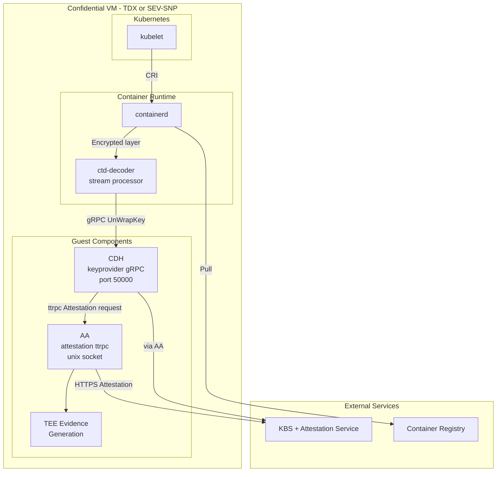

#### Demo Architecture (offline_fs_kbc - Mocked Attestation)

> **Warning**: The demo uses `offline_fs_kbc` mode which stores keys locally without remote attestation. This bypasses the security guarantees of confidential computing and is **NOT suitable for production**.

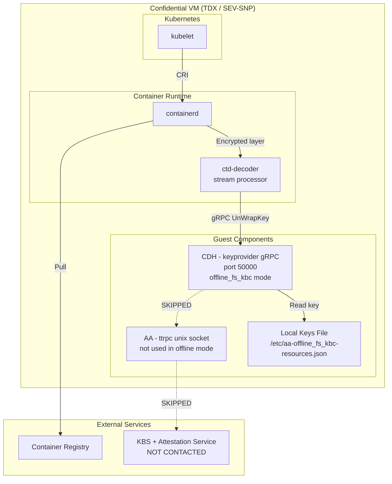

**Key Differences in Demo Mode:**
- CDH configured with `offline_fs_kbc` instead of `cc_kbc`
- Keys stored locally in `/etc/aa-offline_fs_kbc-resources.json` (base64 encoded)
- No remote attestation performed
- KBS is deployed but **not contacted** at runtime
- Attestation Agent runs but is **not used** for key retrieval

### 3.3 How It Works

#### ocicrypt Keyprovider Protocol

The `ocicrypt` library supports a **keyprovider protocol** that allows external services to handle key operations [11]. The configuration is read from the `OCICRYPT_KEYPROVIDER_CONFIG` environment variable [21]. When containerd encounters an encrypted layer:

##### Production Flow (cc_kbc with Remote Attestation)

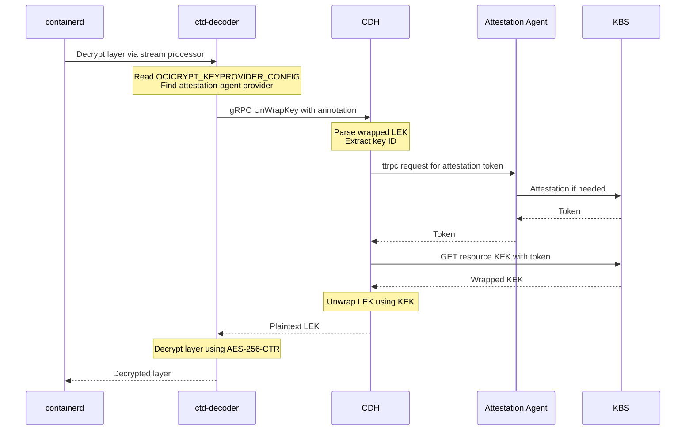

##### Demo Flow (offline_fs_kbc - No Attestation)

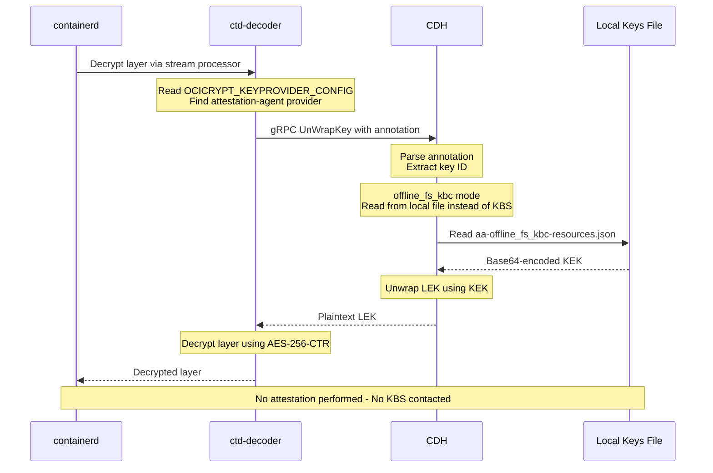

#### CDH as Keyprovider

The Confidential Data Hub (CDH) exposes a gRPC service implementing the keyprovider protocol [15]. The service listens on port 50000 by default for the keyprovider interface:

```protobuf
service KeyProviderService {
    rpc UnWrapKey(keyProviderKeyWrapProtocolInput)
        returns (keyProviderKeyWrapProtocolOutput);
}
```

When CDH receives an `UnWrapKey` request [15], it:
1. Parses the annotation packet containing the wrapped LEK
2. Calls the Attestation Agent (AA) via ttrpc to get an attestation token
3. AA generates TEE evidence and exchanges it with KBS for a token [18]
4. CDH requests the KEK from KBS using the key ID and attestation token [18]
5. CDH unwraps the LEK using the KEK
6. Returns the plaintext LEK to the caller

**Note**: CDH coordinates the entire key retrieval flow, delegating only the attestation step to AA. This separation allows CDH to support multiple Key Broker Clients (KBCs) like `cc_kbc`, `offline_fs_kbc`, etc., each with different attestation and key retrieval strategies [15].

#### containerd Configuration

containerd supports encrypted image decryption through stream processors [10]. The `ctd-decoder` binary from the imgcrypt project handles decryption [10]. Configuration uses `key_model = "node"` where encryption is tied to worker nodes [22].

### 3.4 Components Required

| Component                     | Source                                          | Role                                        |
|-------------------------------|-------------------------------------------------|---------------------------------------------|
| **containerd**                | Standard distribution                           | Container runtime with CRI support [2]      |
| **ctd-decoder**               | `containerd/imgcrypt` [10]                      | Stream processor for encrypted layers       |
| **Confidential Data Hub**     | `confidential-containers/guest-components` [15] | Keyprovider service (gRPC port 50000)       |
| **Attestation Agent**         | `confidential-containers/guest-components` [16] | TEE attestation service (ttrpc unix socket) |
| **KBS + Attestation Service** | `confidential-containers/trustee` [12]          | External key broker and verifier            |

Both CDH and AA can be built with different attesters depending on the TEE platform: `tdx-attester`, `snp-attester`, `az-snp-vtpm-attester`, `az-tdx-vtpm-attester`, `sgx-attester`, `cca-attester`, and `se-attester` [20].

**Build Configuration:**
- CDH: Built with `grpc` and `kbs` features to expose keyprovider service
- AA: Built with `ttrpc` feature to communicate with CDH via unix socket

### 3.5 Image Pull Flow

#### Production Flow (cc_kbc with Remote Attestation)

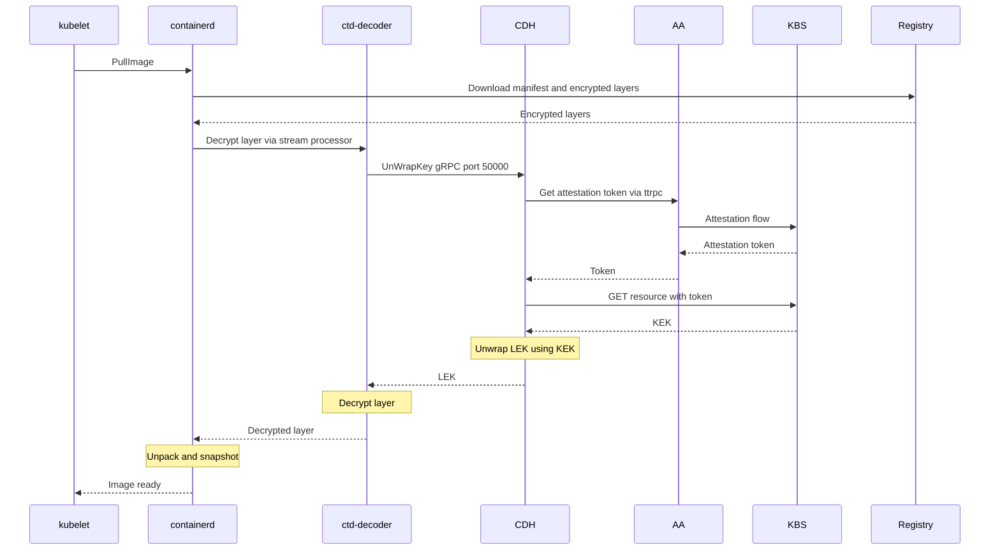

#### Demo Flow (offline_fs_kbc - No Attestation)

> **Note**: This is the flow used in [DEMO.md](./DEMO.md). Attestation is bypassed and keys are read from a local file.

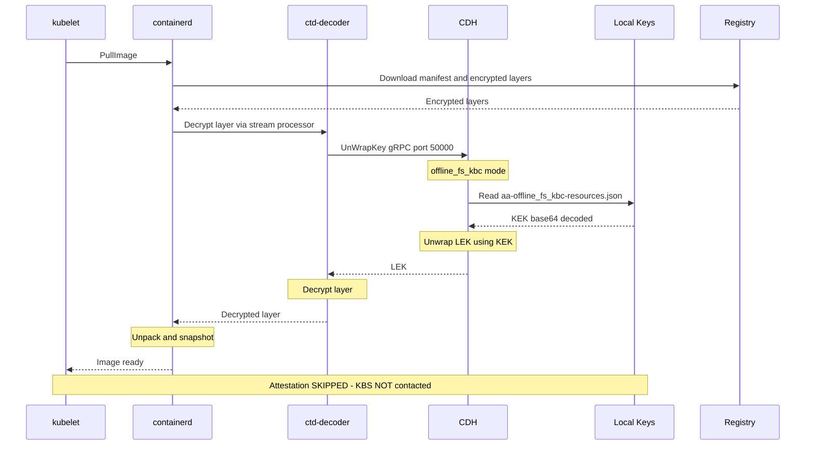

### 3.6 Comparison: CoCo vs This Approach

| Aspect             | Full CoCo (with Kata)             | Without Kata                  |
|--------------------|-----------------------------------|-------------------------------|
| **TEE boundary**   | Micro-VM per pod [23]             | Entire CVM                    |
| **Isolation**      | Pod-level hardware isolation [23] | Node-level hardware isolation |
| **Runtime**        | kata-runtime [6]                  | runc/crun                     |
| **Virtualization** | Required (QEMU/CLH) [6]           | Not required                  |
| **Components**     | kata-agent, image-rs, CDH, AA [6] | AA only [16]                  |
| **Complexity**     | Higher                            | Lower                         |
| **Image pull**     | Inside micro-VM [17]              | On CVM (still in TEE)         |
| **Multi-tenancy**  | Strong (per-pod TEE) [23]         | Weaker (shared CVM) [24]      |

### 3.7 What We Lose Without Kata Runtime

Choosing the no-Kata approach involves significant trade-offs in security properties.

#### 3.7.1 Pod-Level TEE Isolation

**With Kata (CoCo):**

Each pod runs in its own micro-VM backed by a dedicated TEE [23]. Each VM hosts a single kata-agent [23], and each Kata pod gets its own kernel per nested Kata guest VM [24].

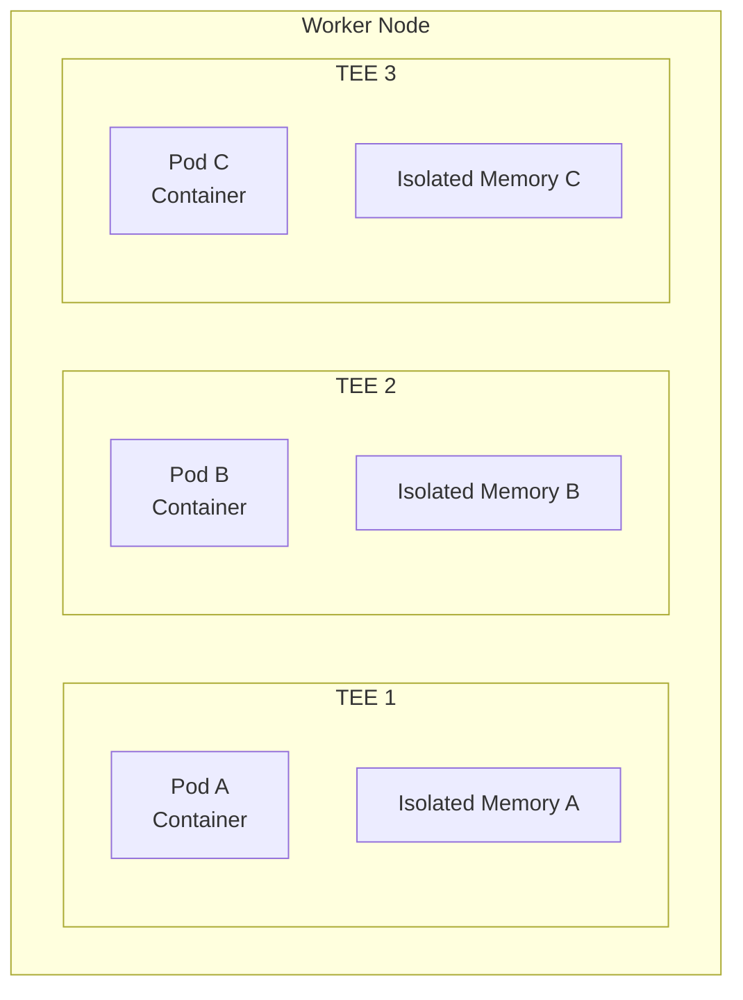

A compromised container cannot access another pod's memory or decrypted data due to hardware-enforced isolation [23].

**Without Kata:**

All pods share the same CVM [24]. CVM-only deployments provide "VM level isolation with unique memory encryption key per VM" — containers share the CVM's memory space while protected from the host [24].

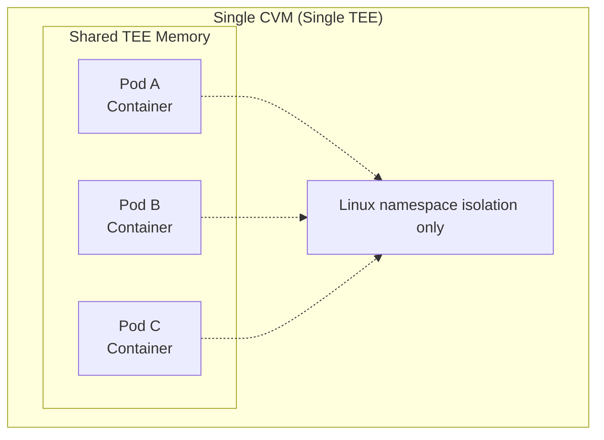

Container isolation relies on Linux namespaces/cgroups, not hardware TEE boundaries.

**Impact:** A container escape vulnerability could expose all workloads' decrypted data within the CVM.

#### 3.7.2 Per-Pod Attestation

| Capability               | With Kata             | Without Kata           |
|--------------------------|-----------------------|------------------------|
| Pod attestation identity | Unique per pod [25]   | Single node identity   |
| KBS policy granularity   | Per-pod policies [25] | Node-level only        |
| Workload verification    | Individual pod [25]   | All pods same identity |
| Multi-tenant attestation | Supported [25]        | Not supported          |

TEEs can be used to encapsulate different levels of the architecture stack with three key levels being node vs pod vs container [25]. With Kata, each pod's CVM has a unique attestation report; without Kata, attestation covers the entire node [25].

**Impact:** Multi-tenant scenarios where different workload owners require independent attestation are not supported.

#### 3.7.3 Per-Pod Encryption Keys

**With Kata:** Each pod's attestation can be verified independently, and KBS can release different keys based on pod-specific policies [18].

**Without Kata:** All image decryption uses the same node-level attestation. The KBS cannot distinguish which pod is requesting the key—it only sees the node's attestation evidence.

**Impact:** Cannot implement fine-grained key release policies based on pod identity.

#### 3.7.4 Kata Agent Policy Enforcement

**With Kata (CoCo):**
The kata-agent enforces Rego policies that restrict operations [26]. The Kata Agent is responsible for enforcing the Policy, working together with OPA, checking the Policy for each ttRPC API request [26].

```rego
# Only allow specific images
CreateContainerRequest if {
    input.image in policy_data.allowed_images
}

# Block exec into containers
ExecProcessRequest := false
```

These policies are evaluated inside the TEE, protecting against malicious host requests [26].

**Without Kata:**
No equivalent policy enforcement layer. The host's kubelet/containerd directly manages containers.

**Impact:** Cannot enforce workload-specific security policies at the TEE boundary.

#### 3.7.5 Protection Against Malicious Orchestration

**With Kata:** The kata-agent validates all requests from the host [26]. Even if the Kubernetes control plane is compromised, TEE-side policy prevents running unauthorized images, executing arbitrary commands, or mounting unauthorized volumes [26].

**Without Kata:** The kubelet and containerd run inside the CVM and are trusted, but the Kubernetes API server is typically outside. A compromised control plane could schedule malicious pods to the CVM.

**Impact:** Trust boundary extends to the Kubernetes control plane, not just the CVM.

#### 3.7.6 Summary: Trade-off Matrix

| Capability                        | With Kata                  | Without Kata        | Impact      |
|-----------------------------------|----------------------------|---------------------|-------------|
| Pod-level TEE isolation           | ✅ Hardware enforced [23]   | ❌ Namespace only    | High        |
| Per-pod attestation               | ✅ Yes [25]                 | ❌ Node-level only   | High        |
| Per-pod key policies              | ✅ Yes [18]                 | ❌ Shared identity   | Medium      |
| Agent policy enforcement          | ✅ Rego policies [26]       | ❌ None              | High        |
| Malicious orchestrator protection | ✅ TEE-side validation [26] | ⚠️ Partial          | Medium      |
| Integrated signature verification | ✅ Tight integration [14]   | ⚠️ Separate config  | Low         |
| Mixed workload types              | ✅ Per-pod choice [6]       | ❌ All-or-nothing    | Medium      |
| Deployment complexity             | ❌ Higher                   | ✅ Lower             | Operational |
| Performance overhead              | ❌ VM per pod [23]          | ✅ Native containers | Performance |


## 4. References

[1] Kubernetes Project, "Container Runtime Interface (CRI)," Kubernetes Documentation. Available: https://kubernetes.io/docs/concepts/architecture/cri/

[2] containerd Authors, "containerd: An industry-standard container runtime," GitHub. Available: https://github.com/containerd/containerd

[3] containerd Authors, "Content Flow," containerd Documentation. Available: https://github.com/containerd/containerd/blob/main/docs/content-flow.md

[4] Open Container Initiative, "OCI Distribution Specification," GitHub. Available: https://github.com/opencontainers/distribution-spec/blob/main/spec.md

[5] Kubernetes Project, "Pull an Image from a Private Registry," Kubernetes Documentation. Available: https://kubernetes.io/docs/tasks/configure-pod-container/pull-image-private-registry/

[6] Confidential Containers Project, "Design Overview," Confidential Containers Documentation. Available: https://confidentialcontainers.org/docs/architecture/design-overview/

[7] containers/ocicrypt Authors, "ocicrypt - OCI image encryption library," GitHub. Available: https://github.com/containers/ocicrypt

[8] Open Container Initiative, "Image Encryption Specification (PR #775)," GitHub. Available: https://github.com/opencontainers/image-spec/pull/775

[9] containers/ocicrypt Authors, "blockcipher.go - AES_256_CTR_HMAC_SHA256," GitHub. Available: https://github.com/containers/ocicrypt/blob/main/blockcipher/blockcipher.go

[10] containerd Authors, "imgcrypt - OCI Image Encryption Package," GitHub. Available: https://github.com/containerd/imgcrypt

[11] containers/ocicrypt Authors, "Keyprovider Protocol," GitHub. Available: https://github.com/containers/ocicrypt/blob/main/docs/keyprovider.md

[12] Confidential Containers Project, "Trustee - Key Broker Service," GitHub. Available: https://github.com/confidential-containers/trustee

[13] Kata Containers Project, "How to run Kata Containers with SNP VMs," GitHub. Available: https://github.com/kata-containers/kata-containers/blob/main/docs/how-to/how-to-run-kata-containers-with-SNP-VMs.md

[14] Confidential Containers Project, "image-rs Design Document," GitHub. Available: https://github.com/confidential-containers/guest-components/blob/main/image-rs/docs/design.md

[15] Confidential Containers Project, "Confidential Data Hub," GitHub. Available: https://github.com/confidential-containers/guest-components/tree/main/confidential-data-hub

[16] Confidential Containers Project, "Attestation Agent," GitHub. Available: https://github.com/confidential-containers/guest-components/tree/main/attestation-agent

[17] containerd Authors, "nydus-snapshotter," GitHub. Available: https://github.com/containerd/nydus-snapshotter

[18] Confidential Containers Project, "KBS Attestation Protocol," GitHub. Available: https://github.com/confidential-containers/trustee/blob/main/kbs/docs/kbs_attestation_protocol.md

[19] containers/ocicrypt Authors, "keyprovider.proto," GitHub. Available: https://github.com/containers/ocicrypt/blob/main/utils/keyprovider/keyprovider.proto

[20] Confidential Containers Project, "Attestation Agent README," GitHub. Available: https://github.com/confidential-containers/guest-components/tree/main/attestation-agent

[21] containers/ocicrypt Authors, "keyprovider-config/config.go," GitHub. Available: https://github.com/containers/ocicrypt/blob/main/config/keyprovider-config/config.go

[22] containerd Authors, "CRI Decryption," GitHub. Available: https://github.com/containerd/containerd/blob/main/docs/cri/decryption.md

[23] Amazon Web Services, "Enhancing Kubernetes workload isolation and security using Kata Containers," AWS Containers Blog. Available: https://aws.amazon.com/blogs/containers/enhancing-kubernetes-workload-isolation-and-security-using-kata-containers/

[24] Microsoft, "Choose Confidential Containers offerings," Azure Documentation. Available: https://learn.microsoft.com/en-us/azure/confidential-computing/choose-confidential-containers-offerings

[25] Confidential Containers Project, "Overview," GitHub. Available: https://github.com/confidential-containers/documentation/blob/main/overview.md

[26] Kata Containers Project, "How to use the Kata Agent Policy," GitHub. Available: https://github.com/kata-containers/kata-containers/blob/main/docs/how-to/how-to-use-the-kata-agent-policy.md
